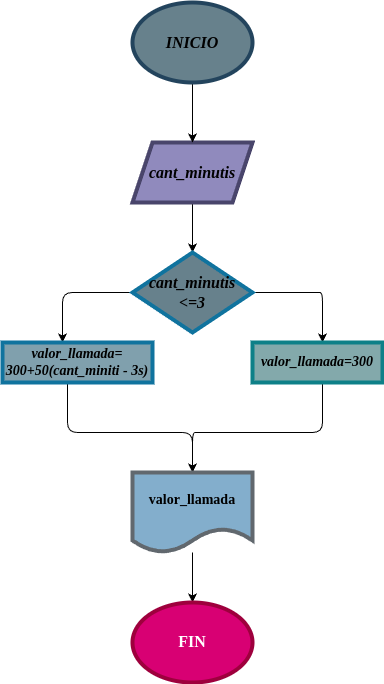

# Condicionales_1
condicionales_1
##  Costo de una llamada telefonica

ingresar el tiempo de duracion de una llamada telefonica y determinar la cantidad a pagarde acuerdo con lo siguiente

- toda llamada que dure tres minutos o menos tiene un costo de 300 pesos

- cada minuto adicional cuesta 50 pesos

